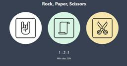
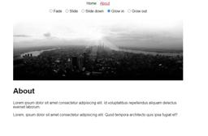
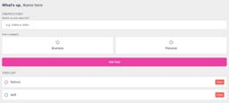
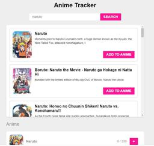
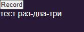
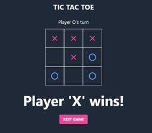
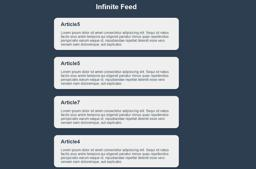

# This is main branch with project description.
## Projects itself in other branches of this repo.

|  #  | Project  | Demo          |Thumbnail|
| :-: | -------- | ------------- |---------|
|01| [Random user](https://github.com/xml12333/vueJS/tree/01-random-user)| | |
|02| [Task app](https://github.com/xml12333/vueJS/tree/02-task-app)| [Demo](https://nikt-vue-task-app.netlify.app/)| |
|03| [Rock paper scissors](https://github.com/xml12333/vueJS/tree/03-rock-paper-scissors)| [Demo](https://nikt-vue-rock-paper-scissors.netlify.app/)| |
|04| [Weight tracker](https://github.com/xml12333/vueJS/tree/04-weight-tracker)| [Demo](https://nikt-vue-weight-tracker.netlify.app/)| |
|05| [Five router animated](https://github.com/xml12333/vueJS/tree/05-five-router-animated)| [Demo](https://nikt-vue-five-router-animated.netlify.app/)| |
|06| [Pinia state management](https://github.com/xml12333/vueJS/tree/06-pinia-state-management)| [Demo](https://nikt-vue-pinia-state-management.netlify.app/)| |
|07| [Todo list](https://github.com/xml12333/vueJS/tree/07-todo-list)| [Demo](https://nikt-vue-todo-list.netlify.app/)| |
|08| [Anime tracker](https://github.com/xml12333/vueJS/tree/08-anime-tracker)| [Demo](https://nikt-vue-anime-tracker.netlify.app/)| |
|09| [Quiz](https://github.com/xml12333/vueJS/tree/09-QUIZ)| [Demo](https://nikt-vue-QUIZ.netlify.app/)| |
|10| [Voice recognition](https://github.com/xml12333/vueJS/tree/10-voice-recognition)| [Demo](https://nikt-vue-voice-recognition.netlify.app/)| |
|11| [Tic tac toe](https://github.com/xml12333/vueJS/tree/11-tic-tac-toe)| [Demo](https://nikt-vue-tic-tac-toe.netlify.app/)| |
|12| [Responsive sidebar](https://github.com/xml12333/vueJS/tree/12-responsive-sidebar)| [Demo](https://nikt-vue-responsive-sidebar.netlify.app/)| |
|13| [Todo app nuxtjs vuex](https://github.com/xml12333/vueJS/tree/13-todo-app-nuxtJs-vuex)| [Demo](https://nikt-vue-todo-app-nuxtJs-vuex.netlify.app/)| |
|14| [Authentication firebase](https://github.com/xml12333/vueJS/tree/14-authentication-firebase)| [Demo](https://nikt-vue-authentication-firebase.netlify.app/)| |
|15| [Infinite scroll](https://github.com/xml12333/vueJS/tree/15-infinite-scroll)| [Demo](https://nikt-vue-infinite-scroll.netlify.app/)| |
|16| [Chat app and firebase](https://github.com/xml12333/vueJS/tree/16-chat-app-and-firebase)| [Demo](https://nikt-vue-chat-app-and-firebase.netlify.app/)| |
|99| [Json server](https://github.com/xml12333/vueJS/tree/99-json-server)| | |
